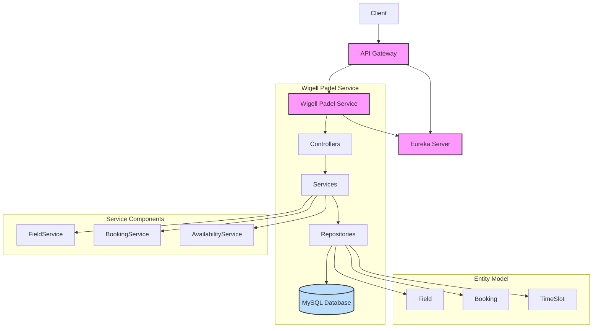

# Wigell Padel Booking System

A microservices-based padel court booking system built with Spring Boot, Eureka for service discovery, and an API Gateway for routing.

## Architecture



## Overview

This project demonstrates a microservices architecture for a padel court booking system. The system allows users to view available courts, book time slots, and manage bookings. Administrators can add, update, and delete courts.

## Features

- **Service Discovery**: Uses Eureka Server for dynamic service registration and discovery
- **API Gateway**: Centralizes request routing to appropriate microservices
- **Field Management**: Add, update, and delete padel courts
- **Booking System**: Create bookings for specific courts and time slots
- **Availability Checking**: Check available courts and time slots for a specific date
- **Role-Based Access**: Different permissions for regular users and administrators
- **Containerization**: Dockerized services for easy deployment

## Technologies Used

- **Spring Boot**: Java-based framework for building microservices
- **Spring Cloud Netflix Eureka**: Service discovery and registration
- **Spring Cloud Gateway**: API Gateway for routing requests
- **Spring Security**: Authentication and authorization
- **MySQL**: Database for persistent storage
- **Docker & Docker Compose**: Containerization and orchestration
- **Maven**: Build and dependency management

## Project Structure

- **eureka-server**: Service registry for microservice discovery
- **api-gateway**: Routes API requests to appropriate microservices
- **wigell-padel**: Core service that handles business logic:
  - **Controllers**: REST endpoints for API operations
  - **Services**: Business logic
  - **Repositories**: Data access layer
  - **Entities**: Data models

## API Endpoints

### Field Management

- `POST /api/v5/addfield`: Add a new padel court (Admin only)
- `DELETE /api/v5/deletefield/{id}`: Delete a padel court (Admin only)
- `PUT /api/v5/updateinfo/{id}`: Update court information (Admin only)

### Booking Management

- `POST /api/v5/booking`: Create a new booking
- `GET /api/v5/bookings`: Get all bookings
- `GET /api/v5/availability/{date}`: Check available courts and time slots for a specific date

## Setup Instructions

### Prerequisites

- Java 11 or higher
- Docker and Docker Compose
- Maven (optional, wrapper included)

### Running Locally

1. Clone the repository:
   ```sh
   git clone https://github.com/your-username/wigell-padel-portfolio.git
   cd wigell-padel-portfolio
   ```

2. Start all services using Docker Compose:
   ```sh
   docker-compose up --build
   ```

3. Access the services:
   - Eureka Server: http://localhost:8761
   - API Gateway: http://localhost:8585
   - Wigell Padel API (via Gateway): http://localhost:8585/api/v5/...
   - Wigell Padel Direct: http://localhost:8584/api/v5/...

### Stopping the Services

```sh
docker-compose down
```

## Security

The application implements role-based access control:
- **Admin Role**: Can manage courts (add, update, delete)
- **User Role**: Can view available courts and make bookings

## Sample Requests

### Check Availability for a Date
```sh
curl -X GET http://localhost:8585/api/v5/availability/2023-05-20
```

### Create a Booking
```sh
curl -X POST http://localhost:8585/api/v5/booking \
  -H "Content-Type: application/json" \
  -d '{"fieldId": 1, "date": "2023-05-20", "time": "10:00"}'
```

## Contributing

Contributions are welcome! Please feel free to submit a Pull Request.

## License

This project is licensed under the Apache License 2.0 - see the LICENSE file for details.